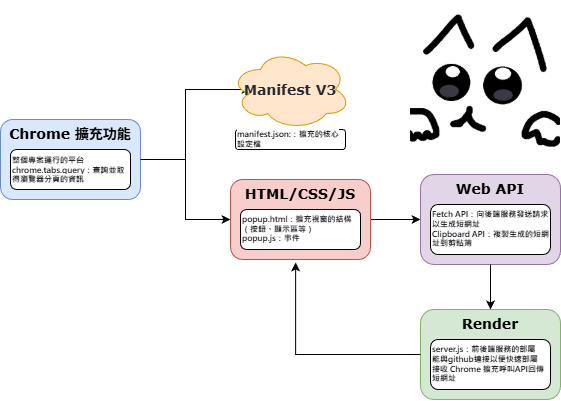
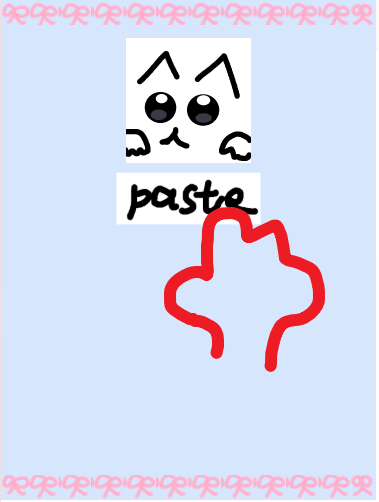
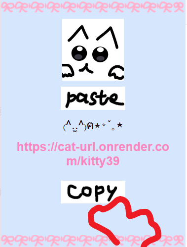

<div style="text-align:left">

# ฅ^. ˬ .^ฅⳊ 喵網址

一個簡單可愛的 **縮短網址 Chrome 擴充**，可將當前分頁網址生成短網址。

---

## 使用到的套件與工具



---

## 安裝步驟

1. 下載或 clone 專案：

```bash
git clone https://github.com/user/cat_url.git
```

2. 打開 Chrome 進入 `chrome://extensions/`  
3. 開啟 **開發者模式**  
4. 點擊 **載入已解壓的擴充功能**  
5. 選擇**chrome_extension**資料夾  
6. 成功!看看工具列有沒有喵網址的icon

---

## 使用教學

1. 點擊 Chrome 工具列的擴充圖示  
2. 點擊 **paste按鈕**將會自動抓取當前頁面網址  

3. 生成完成後，短網址與貓咪顏文字會顯示在中間  
4. 點擊 **copy按鈕**，短網址會複製到剪貼簿ㄛ  


</div>

